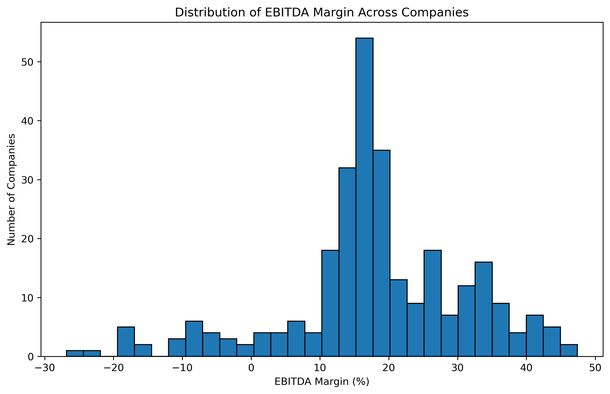
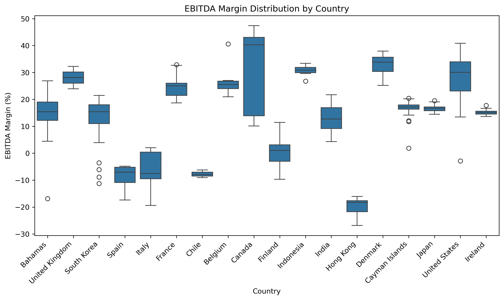
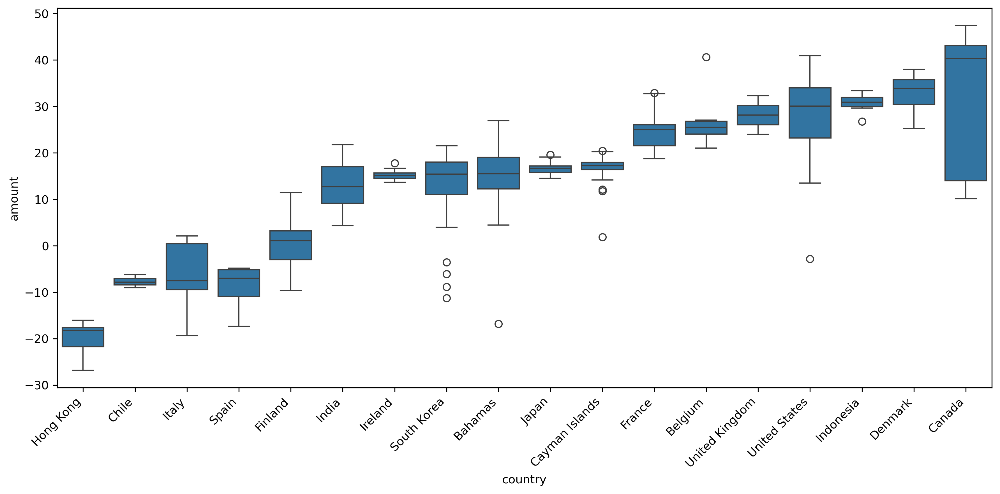

# Nasdaq Data Link API Project

## Overview
This personal project involves importing financial data using Nasdaq Data Link API. The data tables were cleansed, analyzed, and visualized using Python. The project follows the guidance of Dataquest's Director of Curriculum, Anna Strahl, in their uploaded YouTube video entitled [Your First API Project: Analyzing Financial Data with Python (2025)](https://tinyurl.com/4kw4ysk6). 

## Objectives
- Learn the fundamentals of API
- Apply basic data cleansing using Python
- Perform basic analysis on common financial indicator
- Create a simple data visualization

## About the Data
Nasdaq Data Link's MER/F1 data tables refer to **Mergent Global Fundamentals data**, which offers detailed financial statements (e.g., Balance Sheet, Income Statement, Cash Flow, etc.) for global companies, accessible via API or tools like Excel. 

## Output
### EBITDA Margin
**EBITDA Margin** is a financial indicator that shows how much a company earns from its core operations as a percentage of revenue, where EBITDA (Earnings Before Interest, Taxes, Depreciation, and Amortization) strips our non-operating costs like debt, taxes, and asset write-downs. This profitability ratio mainly reveals the companies' operational efficiency, and a higher margin means better operational profitability and cost management. Thus, it is used to compare businesses across industries.  

### Analysis and Visualization
**Figure 1. EBITDA Margin Distribution**
 
 

 
 

**Figure 2. EBITDA Margin Distribution Group by Country**
 
 

 
 
**Figure 3. (Sorted) EBITDA Margin Distribution Group by Country**
 
 

 
 
